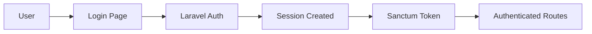

# Architecture Overview

TorrentPier follows a modern, scalable architecture built on Laravel's proven patterns and best practices.

## Tech Stack

### Backend
- **Framework**: Laravel 12
- **Language**: PHP 8.4+
- **Authentication**: Laravel Sanctum
- **Search**: Laravel Scout + Meilisearch
- **Monitoring**: Laravel Telescope
- **Testing**: Pest PHP

### Frontend
- **Library**: React 19
- **Language**: TypeScript
- **Routing**: Inertia.js
- **Styling**: Tailwind CSS v4
- **Components**: shadcn/ui
- **Build Tool**: Vite

## Application Structure

```
torrentpier/
├── app/                    # Application code
│   ├── Http/              # Controllers, Middleware, Requests
│   ├── Models/            # Eloquent models
│   └── Providers/         # Service providers
├── resources/             # Frontend resources
│   ├── js/               # React components and pages
│   ├── css/              # Stylesheets
│   └── views/            # Blade templates
├── routes/               # Application routes
├── database/             # Migrations, factories, seeders
├── config/               # Configuration files
├── tests/                # Test suites
└── legacy/               # Legacy codebase (reference)
```

## Key Design Patterns

### 1. Inertia.js Integration

Inertia.js bridges Laravel and React, providing:
- Server-side routing with client-side rendering
- Automatic data synchronization
- No API development overhead
- SEO-friendly SSR support

### 2. Component-Based Architecture

Frontend follows a component-based structure:
- **Pages**: Full-page components in `resources/js/pages/`
- **Layouts**: Reusable layout wrappers
- **Components**: Shared UI components using shadcn/ui
- **Hooks**: Custom React hooks for common functionality

### 3. Laravel Best Practices

- **Repository Pattern**: For complex data operations
- **Service Classes**: Business logic separation
- **Form Requests**: Input validation
- **Resources**: API response transformation
- **Policies**: Authorization logic

## Data Flow

1. **Request**: Browser sends request to Laravel route
2. **Controller**: Processes request, queries data
3. **Inertia**: Renders page component with props
4. **React**: Renders UI with received data
5. **Forms**: Submit via Inertia, maintaining SPA feel

## Authentication Flow



## BitTorrent Integration

### Tracker Protocol
- Announce endpoint: `/announce`
- Scrape endpoint: `/scrape`
- Peer management via Redis
- Stats aggregation with scheduled jobs

### File Handling
- Torrent parsing and validation
- Secure file storage
- NFO file processing
- Screenshot management

## Performance Optimizations

### Caching Strategy
- **Redis**: Session storage, cache, queues
- **Query Caching**: For expensive database queries
- **Route Caching**: Production optimization
- **View Caching**: Compiled Blade templates

### Database Optimization
- Indexed columns for tracker queries
- Eager loading for N+1 prevention
- Database query optimization
- Connection pooling

## Security Architecture

### Application Security
- CSRF protection
- XSS prevention
- SQL injection protection
- Rate limiting
- Input validation

### Tracker Security
- Passkey authentication
- IP binding options
- Anti-cheat mechanisms
- Ratio enforcement

## Scalability Considerations

### Horizontal Scaling
- Stateless application design
- Redis for shared state
- Queue workers for background jobs
- CDN for static assets

### Vertical Scaling
- Database read replicas
- Caching layers
- Optimized queries
- Resource monitoring

## Development Workflow

1. **Local Development**: Vite dev server + Laravel
2. **Testing**: Pest for PHP, Jest for React
3. **Building**: Vite production build
4. **Deployment**: Zero-downtime deployments

## Future Considerations

- GraphQL API implementation
- WebSocket real-time updates
- Microservice extraction
- Container orchestration
